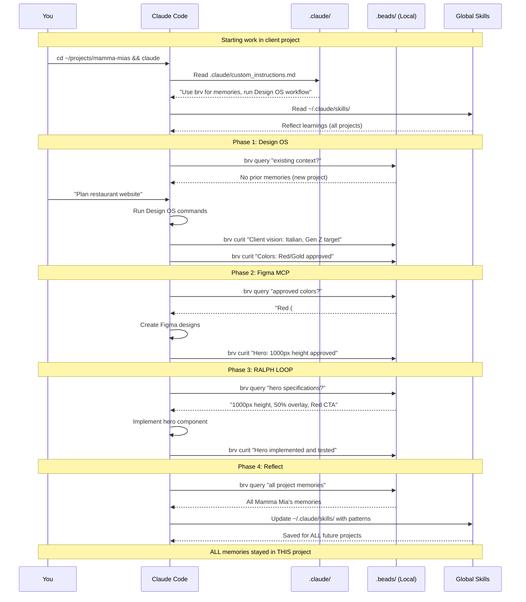

# Claude Code Instance Separation - Visual Guide

## Overview

Each project has its **own isolated Claude Code instance** with independent configuration.

---

## Visual: Multi-Project Setup

```
┌─────────────────────────────────────────────────────────────┐
│                    YOUR MACHINE                              │
│                                                              │
│  ┌────────────────────────────────────────────────────────┐ │
│  │  GLOBAL (Shared Across All Projects)                   │ │
│  │                                                         │ │
│  │  ~/.claude/                                            │ │
│  │  ├── settings.json        ← Global settings           │ │
│  │  └── skills/              ← Reflect (learns from all) │ │
│  │      ├── brand-design/                                 │ │
│  │      ├── implementation/                               │ │
│  │      └── qa-verification/                              │ │
│  └────────────────────────────────────────────────────────┘ │
│                                                              │
│  ┌────────────────────────────────────────────────────────┐ │
│  │  PROJECT 1: Designbrnd                                 │ │
│  │  Working Dir: /home/user/Designbrnd                    │ │
│  │                                                         │ │
│  │  ├── .claude/              ← Project-specific config  │ │
│  │  │   ├── custom_instructions.md                        │ │
│  │  │   └── commands/                                     │ │
│  │  │       ├── design-os/                                │ │
│  │  │       └── reflect.md                                │ │
│  │  │                                                      │ │
│  │  ├── .beads/               ← Project-specific memories│ │
│  │  │   └── tasks/                                        │ │
│  │  │       • Design OS decisions                         │ │
│  │  │       • Architecture choices                        │ │
│  │  │       • Framework learnings                         │ │
│  │  │                                                      │ │
│  │  ├── .brv/                 ← ByteRover config          │ │
│  │  │   └── config.json                                   │ │
│  │  │                                                      │ │
│  │  └── src/                  ← Codebase                  │ │
│  │                                                         │ │
│  │  When Claude Code runs here:                           │ │
│  │  ✓ Reads .claude/custom_instructions.md from HERE     │ │
│  │  ✓ Uses .beads/ memories from HERE                     │ │
│  │  ✓ Has access to Design OS commands                    │ │
│  └────────────────────────────────────────────────────────┘ │
│                                                              │
│  ┌────────────────────────────────────────────────────────┐ │
│  │  PROJECT 2: Restaurant Client (Mamma Mia's)           │ │
│  │  Working Dir: /home/user/projects/mamma-mias          │ │
│  │                                                         │ │
│  │  ├── .claude/              ← Different config!        │ │
│  │  │   ├── custom_instructions.md                        │ │
│  │  │   └── commands/                                     │ │
│  │  │       ├── design-os/                                │ │
│  │  │       ├── figma-mcp/                                │ │
│  │  │       └── ralph-loop/                               │ │
│  │  │                                                      │ │
│  │  ├── .beads/               ← Different memories!      │ │
│  │  │   └── tasks/                                        │ │
│  │  │       • Client approved: Red/Gold colors            │ │
│  │  │       • Hero section: 1000px height                 │ │
│  │  │       • Menu grid: 3 columns                        │ │
│  │  │                                                      │ │
│  │  ├── .brv/                                             │ │
│  │  │   └── config.json                                   │ │
│  │  │                                                      │ │
│  │  ├── e2e/                  ← RALPH LOOP tests          │ │
│  │  └── app/                  ← Next.js codebase          │ │
│  │                                                         │ │
│  │  When Claude Code runs here:                           │ │
│  │  ✓ Reads .claude/custom_instructions.md from HERE     │ │
│  │  ✓ Uses .beads/ memories from HERE                     │ │
│  │  ✓ Has access to full workflow commands                │ │
│  └────────────────────────────────────────────────────────┘ │
│                                                              │
│  ┌────────────────────────────────────────────────────────┐ │
│  │  PROJECT 3: Tech Startup Client (SaaS Platform)       │ │
│  │  Working Dir: /home/user/projects/saas-startup        │ │
│  │                                                         │ │
│  │  ├── .claude/              ← Yet another config!      │ │
│  │  ├── .beads/               ← Yet another set!         │ │
│  │  ├── .brv/                                             │ │
│  │  └── src/                                              │ │
│  │                                                         │ │
│  │  Completely isolated from other projects!             │ │
│  └────────────────────────────────────────────────────────┘ │
└─────────────────────────────────────────────────────────────┘
```

---

## Workflow Cluster Across Projects

### Project 1: Designbrnd (Meta-Project)

**Purpose:** Build and test the workflow tools themselves

```
Designbrnd/
├── .claude/
│   ├── custom_instructions.md
│   │   • Rules for Design OS development
│   │   • Rules for ByteRover development
│   │   • Thread-based engineering
│   └── commands/
│       ├── design-os/          # Design OS commands (we're building these)
│       └── reflect.md          # Reflect skill
│
├── .beads/                     # Meta-level memories
│   └── tasks/
│       • "Thread-based framework learnings"
│       • "ByteRover architecture decisions"
│       • "Workflow cluster integration strategy"
│
├── src/                        # Design OS React app
└── docs/                       # All our planning docs
```

**When you run Claude Code in Designbrnd:**
- Context: Building workflow tools
- Memories: Architecture, framework learnings
- Not client work!

---

### Project 2: Client Project (Using the Workflow)

**Purpose:** Deliver client website using the workflow

```
mamma-mias-restaurant/
├── .claude/
│   ├── custom_instructions.md
│   │   • Rules for using Design OS (not building it!)
│   │   • Rules for ByteRover memory
│   │   • Rules for RALPH LOOP
│   └── commands/
│       ├── design-os/          # Design OS commands (SAME as Designbrnd)
│       ├── figma-mcp/          # If using Figma
│       └── ralph-loop/         # If using RALPH
│
├── .beads/                     # Client-specific memories
│   └── tasks/
│       • "Client approved: Red/Gold Italian theme"
│       • "Hero section: 1000px with 50% overlay"
│       • "Menu grid: 3 columns, Card components"
│       • "Booking form: Date picker implemented"
│
├── app/                        # Client's Next.js app
├── e2e/                        # Client's tests
└── product/                    # Client's Design OS files
    ├── product-overview.md
    ├── design-system/
    │   ├── colors.json
    │   └── typography.json
    └── sections/
```

**When you run Claude Code in client project:**
- Context: Building THIS client's website
- Memories: THIS client's decisions, specs, implementation
- Uses workflow tools but doesn't modify them

---

## Memory Flow in Client Project



---

## Starting a New Client Project

### Step 1: Copy Template

```bash
# You've built the template in Designbrnd
cp -r ~/workflow-template ~/projects/new-client
cd ~/projects/new-client
```

**What gets copied:**
```
new-client/
├── .claude/
│   ├── custom_instructions.md  ✅ Copy
│   └── commands/               ✅ Copy (Design OS, RALPH, etc.)
├── .beads/                     ❌ Don't copy (start fresh!)
├── .brv/                       ❌ Don't copy (start fresh!)
└── product/                    ❌ Don't copy (client-specific!)
```

---

### Step 2: Initialize

```bash
# Initialize git
git init
git remote add origin git@github.com:yourteam/new-client.git

# Initialize ByteRover
brv init                # Creates .beads/, .brv/
brv gen-rules           # Updates .claude/custom_instructions.md

# You now have a clean project ready for workflow!
```

---

### Step 3: Run Workflow

```bash
# Phase 1: Design OS
claude
# Agent: "Let's plan your website"
# brv curit "Client vision..."
# brv curit "Colors chosen..."

# Phase 2: Figma MCP (if applicable)
# Agent queries: brv query "approved colors?"
# Gets: THIS project's colors from .beads/

# Phase 3: RALPH LOOP
# Agent queries: brv query "design specs?"
# Gets: THIS project's specs from .beads/

# Phase 4: Reflect (automatic)
# Updates: ~/.claude/skills/ (benefits ALL projects)
```

---

## Advanced: Sharing Patterns Across Projects

### Scenario: 10 Restaurant Clients

**Problem:** Each restaurant is similar. Can we reuse patterns?

**Solution: Hybrid Approach**

```
~/.claude/
└── skills/                    ← General principles (Reflect)
    └── brand-design/
        └── SKILL.md
            "Italian restaurants prefer warm colors"

~/patterns/
└── restaurant/                ← Specific patterns (optional)
    ├── .beads/
    │   └── tasks/
    │       • "Menu grid: 3 columns works best"
    │       • "Booking form: Date + Time + Party size"
    │       • "Hero overlay: 50% black for food photos"
    └── .brv/

~/projects/client-1/           ← Client 1 specific
├── .beads/
│   └── tasks/
│       • "Mamma Mia's: Red/Gold approved"
│       • "Client wants rustic feel"

~/projects/client-2/           ← Client 2 specific
├── .beads/
│   └── tasks/
│       • "Giuseppe's: Orange/Brown approved"
│       • "Client wants modern feel"
```

**Agent behavior:**
```markdown
# .claude/custom_instructions.md

## Memory Sources

1. Project memories: brv query (THIS client)
2. Restaurant patterns: Query ~/patterns/restaurant/ (general)
3. Reflect skills: ~/.claude/skills/ (principles)

When starting restaurant features:
1. Query local .beads/ for client specifics
2. Query ~/patterns/restaurant/ for proven patterns
3. Apply Reflect principles for quality
```

**Result:**
- ✅ Client data isolated
- ✅ Proven patterns reused
- ✅ Reflect learns from all
- ✅ Best of all worlds

---

## Team Collaboration

### Scenario: 2 Developers, 1 Client Project

**Developer A:**
```bash
# Morning work
cd ~/projects/client-restaurant
brv curit "Implemented hero section" @hero.tsx

# End of day
brv push                      # git push .beads/
git push                      # git push code
```

**Developer B:**
```bash
# Start of day
cd ~/projects/client-restaurant
git pull                      # Get code
brv pull                      # Get memories!

# Now can query Dev A's work
brv query "hero section implementation"
→ Gets Dev A's notes from morning!
```

**Both share:**
- ✅ Code (git)
- ✅ Memories (brv = git)
- ✅ Reflect skills (~/.claude/skills/)

**Both have separate:**
- ❌ Claude Code sessions (per machine)
- ❌ Local agent state

---

## Summary: Key Points

### 1. Claude Code Instances = Per Project

```
Project A + .claude/  →  Agent Instance A
Project B + .claude/  →  Agent Instance B
Project C + .claude/  →  Agent Instance C
```

**Completely isolated!**

---

### 2. ByteRover Memories = Per Project

```
Project A + .beads/  →  Project A memories
Project B + .beads/  →  Project B memories
Project C + .beads/  →  Project C memories
```

**Completely isolated!**

---

### 3. Reflect Skills = Global (Shared)

```
~/.claude/skills/  →  ALL projects benefit
```

**Learns from everything!**

---

### 4. Workflow Commands = Copy Template

```
workflow-template/.claude/commands/
  →  Copy to each new project
```

**Same tools, different projects!**

---

## Decision Tree: Where Does This Go?

```
┌─ Is this a GENERAL PRINCIPLE? ─────────────────────────────┐
│  (e.g., "Always validate user input")                      │
│                                                             │
│  YES → ~/.claude/skills/ (Reflect)                         │
│  NO  → Continue...                                          │
└─────────────────────────────────────────────────────────────┘

┌─ Is this a REUSABLE PATTERN across similar projects? ──────┐
│  (e.g., "Restaurant menu grid: 3 columns")                 │
│                                                             │
│  YES → ~/patterns/{domain}/.beads/                         │
│  NO  → Continue...                                          │
└─────────────────────────────────────────────────────────────┘

┌─ Is this CLIENT-SPECIFIC? ─────────────────────────────────┐
│  (e.g., "Client approved Red color")                       │
│                                                             │
│  YES → {project}/.beads/ (ByteRover)                       │
└─────────────────────────────────────────────────────────────┘
```

---

## Next Steps

1. ✅ **Understand separation** (you got it!)
2. ⏳ **Build CLI in Designbrnd** (test the system)
3. ⏳ **Create workflow-template** (reusable setup)
4. ⏳ **Test with client project** (prove it works)
5. ⏳ **Refine and scale** (10x output!)

**Ready to build?** Let's start with Phase 1 CLI implementation! 🚀
