# Thread-Based Engineering - Sequence Diagrams

## 1. Base Thread (P → R)

---

## 2. P-Thread (Parallel Execution)

---

## 3. C-Thread (Workflow Cluster - 4 Phases)

---

## 4. F-Thread (Fusion - Best of 3)

---

## 5. B-Thread (Orchestrator with Sub-Agents)

```mermaid
sequenceDiagram
    participant U as User
    participant O as Orchestrator Agent
    participant S1 as Sub-Agent: Plan
    participant S2 as Sub-Agent: Build
    participant S3 as Sub-Agent: Review
    participant BR as ByteRover

    Note over U,BR: B-THREAD: Orchestrator manages sub-agents

    U->>O: PROMPT: "Build complete booking system"

    O->>BR: Query: "Project context"
    BR-->>O: Design specs + colors + sections

    O->>O: Decompose into sub-tasks

    rect rgb(220, 220, 255)
        Note over O,BR: Orchestrator runs 3 sub-agents

        O->>S1: Spawn: "Plan booking system architecture"
        S1->>BR: Query architecture patterns
        S1->>S1: Create plan
        S1->>BR: Save plan
        S1-->>O: Plan complete

        O->>S2: Spawn: "Build booking components"
        S2->>BR: Query plan
        S2->>S2: Implement 5 components
        S2->>BR: Save implementation
        S2-->>O: Build complete

        O->>S3: Spawn: "Review and test"
        S3->>BR: Query implementation
        S3->>S3: Run tests
        S3->>BR: Save test results
        S3-->>O: Review complete
    end

    O->>BR: Curate: "Booking system complete via orchestration"
    O-->>U: All done! Ready to review.

    U->>U: REVIEW: Final result only
    U->>O: ✅ Ship it

    Note over U,BR: B-Thread Complete: 1 prompt, 3 sub-threads, 84 tool calls
    Note over U,BR: User sees: P → R (simple)
    Note over U,BR: Under hood: Complex orchestration
```

---

## 6. L-Thread (Long-Running RALPH LOOP)

---

## 7. Complete Workflow with ByteRover Integration

---

## 8. P-Thread (Boris Style - 10 Agents)

---

## 9. Transcript + Image Processing

---

## 10. Improvement Metrics Over Time

---

## Summary

**Thread Types:**
1. **Base** - Single agent, single task (P → R)
2. **P-Thread** - Multiple agents in parallel (3-10+)
3. **C-Thread** - Chained phases with checkpoints (your workflow!)
4. **F-Thread** - Fusion of multiple agent outputs (best-of-N)
5. **B-Thread** - Orchestrated with sub-agents (nested threads)
6. **L-Thread** - Long-running autonomous (hours/days)
7. **Z-Thread** - Zero-touch, maximum trust (future state)

**ByteRover Role:**
- Stores context between ALL threads
- Enables cross-thread queries
- Provides complete audit trail
- Supports improvement tracking
- Powers Reflect learning

**Improvement Path:**
Week 1: Base threads → 1x output
Week 2: P-Threads → 2.5x output
Week 3: L-Threads → 4x output
Week 4: B-Threads → 7x output
Week 5: Z-Threads → 10x output

**Next:** Implement `brv pthread` and `brv workflow` commands! 🚀
