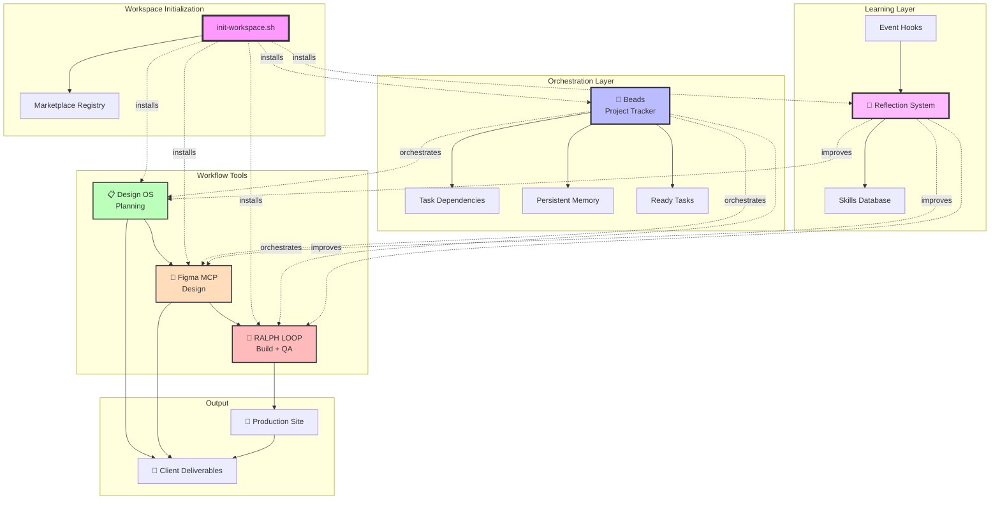
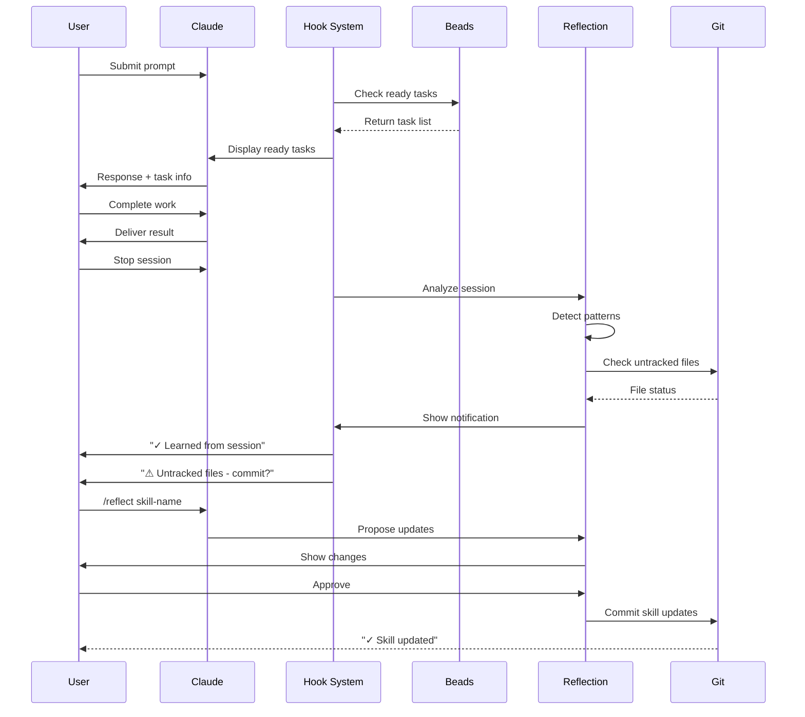

# Complete System Architecture
## Designbrnd AI-Powered Consulting Workflow

---

## High-Level Architecture



---

## Detailed Component Architecture

```mermaid
graph LR
    subgraph "Initialization"
        I1[Prerequisites Check]
        I2[Workspace Creation]
        I3[Tool Installation]
        I4[Configuration]
        I5[Git Setup]

        I1 --> I2
        I2 --> I3
        I3 --> I4
        I4 --> I5
    end

    subgraph "Design OS"
        D1[/product-vision]
        D2[/product-roadmap]
        D3[/data-model]
        D4[/design-tokens]
        D5[/shape-section]
        D6[/sample-data]
        D7[/export-product]

        D1 --> D2
        D2 --> D3
        D3 --> D4
        D4 --> D5
        D5 --> D6
        D6 --> D7
    end

    subgraph "Figma MCP"
        F1[AI Agent]
        F2[MCP Server]
        F3[WebSocket]
        F4[Figma Plugin]
        F5[Figma Document]

        F1 <--> F2
        F2 <--> F3
        F3 <--> F4
        F4 <--> F5
    end

    subgraph "RALPH LOOP"
        R1[Write Tests]
        R2[Run Tests - FAIL]
        R3[Implement]
        R4[Run Tests - PASS]
        R5[Verify Screenshots]
        R6[Fix Issues]
        R7[Mark Verified]
        R8[Promise DONE]

        R1 --> R2
        R2 --> R3
        R3 --> R4
        R4 --> R5
        R5 --> R6
        R6 --> R4
        R5 --> R7
        R7 --> R8
    end

    subgraph "Beads"
        B1[Initialize]
        B2[Create Tasks]
        B3[Track Dependencies]
        B4[Show Ready]
        B5[Mark Complete]
        B6[Git Commit]

        B1 --> B2
        B2 --> B3
        B3 --> B4
        B4 --> B5
        B5 --> B6
    end

    subgraph "Reflection"
        RF1[Session Work]
        RF2[User Corrections]
        RF3[Pattern Detection]
        RF4[Skill Updates]
        RF5[Git Commit]

        RF1 --> RF2
        RF2 --> RF3
        RF3 --> RF4
        RF4 --> RF5
    end

    I5 --> D1
    D7 --> R1
    D4 --> F1
```

---

## Data Flow Architecture

```mermaid
flowchart TD
    START([New Client Project])

    START --> INIT{Initialize Workspace}

    INIT --> |Week 1| DISC[Discovery Phase]
    DISC --> PV[/product-vision]
    DISC --> PR[/product-roadmap]
    DISC --> DM[/data-model]

    PV --> BD1[Beads: Track Tasks]
    PR --> BD1
    DM --> BD1

    BD1 --> |Week 2| BRAND[Brand Design Phase]
    BRAND --> DT[/design-tokens]
    DT --> TOKENS[(colors.json<br/>typography.json)]

    TOKENS --> FMCP1[Figma MCP:<br/>Create Brand System]
    FMCP1 --> FIGMA1[(Figma File:<br/>Brand Guidelines)]

    FIGMA1 --> CLIENT1{Client Approval}
    CLIENT1 --> |Approved| BD2[Beads: Mark Complete]
    CLIENT1 --> |Changes| FMCP1

    BD2 --> |Week 3| SCREEN[Screen Design Phase]
    SCREEN --> SS[/shape-section]
    SCREEN --> SD[/sample-data]

    SS --> SPECS[(spec.md)]
    SD --> DATA[(data.json)]

    SPECS --> FMCP2[Figma MCP:<br/>Create Screens]
    DATA --> FMCP2
    FIGMA1 --> FMCP2

    FMCP2 --> FIGMA2[(Figma File:<br/>Screen Designs)]

    FIGMA2 --> CLIENT2{Client Approval}
    CLIENT2 --> |Approved| BD3[Beads: Mark Complete]
    CLIENT2 --> |Changes| FMCP2

    BD3 --> |Week 4-5| IMPL[Implementation Phase]
    IMPL --> EXP[/export-product]
    EXP --> PACK[(product-plan.zip)]

    PACK --> TESTS[Write E2E Tests]
    FIGMA2 --> TESTS

    TESTS --> RL[RALPH LOOP]
    RL --> |Run| FAIL{Tests Pass?}
    FAIL --> |No| IMP[Implement Components]
    IMP --> RL

    FAIL --> |Yes| VER[Verify Screenshots]
    VER --> |Issues| FIX[Fix Visual Issues]
    FIX --> RL

    VER --> |OK| VERIFIED[Mark Verified]
    VERIFIED --> PROMISE[Promise: DONE]

    PROMISE --> BD4[Beads: Mark Complete]

    BD4 --> |Week 6| LAUNCH[Launch Phase]
    LAUNCH --> DEPLOY[Deploy to Production]
    DEPLOY --> HANDOFF[Client Handoff]

    HANDOFF --> END([Project Complete])

    subgraph "Continuous Learning"
        REFLECT[/reflect]
        SKILLS[(Skills Database)]
        REFLECT --> SKILLS
        SKILLS -.improves.-> PV
        SKILLS -.improves.-> DT
        SKILLS -.improves.-> FMCP1
        SKILLS -.improves.-> FMCP2
        SKILLS -.improves.-> RL
    end

    CLIENT1 -.feedback.-> REFLECT
    CLIENT2 -.feedback.-> REFLECT
    PROMISE -.patterns.-> REFLECT

    style START fill:#f9f
    style END fill:#bfb
    style INIT fill:#bbf
    style REFLECT fill:#fbf
    style PROMISE fill:#fbb
```

---

## Marketplace System Architecture

```mermaid
graph TD
    subgraph "Registry"
        REG[registry.json]
        MCP[MCP Servers]
        SKILLS[Skills]
        HOOKS[Hooks]
        TOOLS[Tools]
        WORKFLOWS[Workflows]

        REG --> MCP
        REG --> SKILLS
        REG --> HOOKS
        REG --> TOOLS
        REG --> WORKFLOWS
    end

    subgraph "Installation"
        CMD[/marketplace]
        BROWSE[Browse Tools]
        INFO[Get Info]
        INSTALL[Install Tool]

        CMD --> BROWSE
        CMD --> INFO
        CMD --> INSTALL
    end

    subgraph "Tools Available"
        T1[Figma MCP<br/>Design Automation]
        T2[Design OS<br/>Planning]
        T3[RALPH LOOP<br/>Testing]
        T4[Beads<br/>Project Tracking]
        T5[Reflection<br/>Learning]
    end

    REG --> CMD
    INSTALL --> T1
    INSTALL --> T2
    INSTALL --> T3
    INSTALL --> T4
    INSTALL --> T5

    T1 -.uses.-> MCP
    T2 -.uses.-> WORKFLOWS
    T3 -.uses.-> TOOLS
    T4 -.uses.-> TOOLS
    T5 -.uses.-> SKILLS
    T5 -.uses.-> HOOKS
```

---

## Hooks & Events Architecture



---

## File System Architecture

```
workspace-root/
│
├── product/                           ← Design OS outputs
│   ├── product-overview.md            ← /product-vision
│   ├── product-roadmap.md             ← /product-roadmap
│   ├── data-model/
│   │   └── data-model.md              ← /data-model
│   ├── design-system/
│   │   ├── colors.json                ← /design-tokens
│   │   └── typography.json            ← /design-tokens
│   └── sections/
│       └── [section-id]/
│           ├── spec.md                ← /shape-section
│           ├── data.json              ← /sample-data
│           └── *.png                  ← Screenshots
│
├── src/                               ← Next.js app
│   ├── app/                           ← App Router
│   ├── components/
│   │   └── ui/                        ← shadcn/ui
│   └── lib/
│
├── e2e/                               ← Playwright tests
│   ├── screenshots/
│   │   └── [feature]/
│   │       └── verified_*.png         ← RALPH LOOP verified
│   └── *.spec.ts                      ← E2E tests
│
├── .beads/                            ← Beads storage
│   └── *.jsonl                        ← Task data (git-tracked)
│
├── .claude/                           ← Claude config
│   ├── commands/                      ← All commands
│   │   ├── design-os/                 ← Design OS cmds
│   │   ├── marketplace.md             ← Marketplace
│   │   ├── ralph-loop.md              ← RALPH guidance
│   │   ├── reflect.md                 ← Reflection
│   │   └── beads-init.md              ← Beads setup
│   │
│   ├── marketplace/
│   │   └── registry.json              ← Tool registry
│   │
│   ├── hooks/
│   │   ├── stop-hook-reflect.sh       ← Auto-reflect
│   │   └── user-prompt-submit-beads.sh ← Beads integration
│   │
│   └── mcp-servers/
│       └── figma-mcp.json             ← MCP config
│
├── ~/.claude/skills/                  ← Global skills
│   ├── client-discovery/SKILL.md
│   ├── brand-design/SKILL.md
│   ├── figma-design/SKILL.md
│   ├── implementation/SKILL.md
│   └── qa-verification/SKILL.md
│
├── claude.md                           ← Figma design rules
├── .beads-template.json               ← Project template
├── package.json                       ← Dependencies
├── playwright.config.ts               ← Test config
└── README.md                          ← Documentation
```

---

## Integration Points

### Design OS → Figma MCP

```
Design OS Output          →  Figma MCP Input
─────────────────────────────────────────────
colors.json               →  Create color styles
typography.json           →  Create text styles
spec.md                   →  Screen structure
data.json                 →  Sample content
claude.md                  →  Design rules
```

### Figma MCP → RALPH LOOP

```
Figma Output              →  RALPH LOOP Input
─────────────────────────────────────────────
Screen designs            →  E2E test specs
Component library         →  shadcn/ui selection
Color styles              →  CSS color values
Typography scale          →  Font size tests
Layout structure          →  DOM assertions
```

### RALPH LOOP → Beads

```
RALPH LOOP Events         →  Beads Actions
─────────────────────────────────────────────
Tests written             →  Mark task "in progress"
Tests passing             →  Update checklist item
Screenshots verified      →  Update checklist item
Promise DONE              →  Mark task "complete"
```

### Reflection → All Tools

```
Tool Usage                →  Skill Learning
─────────────────────────────────────────────
/product-vision           →  client-discovery skill
/design-tokens            →  brand-design skill
Figma MCP usage           →  figma-design skill
RALPH LOOP                →  implementation skill
Screenshot verify         →  qa-verification skill
```

---

## Summary

This architecture provides:

✅ **One-Command Init** - `init-workspace.sh` sets up everything
✅ **Orchestration** - Beads tracks all tasks with dependencies
✅ **Learning** - Reflection system improves with every project
✅ **Automation** - Figma MCP creates designs in minutes
✅ **Quality** - RALPH LOOP ensures pixel-perfect builds
✅ **Marketplace** - Browse and install tools easily
✅ **Hooks** - Event-driven automation
✅ **Complete Workflow** - 6 weeks from discovery to launch

**Result:** The most advanced AI-powered consulting workflow in existence.

---

**Last Updated:** 2026-01-10
**Version:** 1.0
