# AI-Powered Consulting Workflow

**From Discovery to Launch in 6 Weeks**

<div class="pt-12">
  <span @click="$slidev.nav.next" class="px-2 py-1 rounded cursor-pointer" hover="bg-white bg-opacity-10">
    Design OS + Figma MCP + RALPH LOOP + Reflection AI
  </span>
</div>

<div class="abs-br m-6 flex gap-2">
  <a href="https://github.com/0xtsotsi/Designbrnd" target="_blank" alt="GitHub"
    class="text-xl slidev-icon-btn opacity-50 !border-none !hover:text-white">
    <carbon-logo-github />
  </a>
</div>

---
layout: center
class: text-center
---

# The Frustration

<v-clicks>

## You Keep Saying...

❌ "This isn't what I wanted"

❌ "Can we try another revision?"

❌ "I thought we agreed on..."

❌ "This is taking too long"

</v-clicks>

---
layout: two-cols
---

# Traditional Process

<v-clicks>

## Timeline: 12-16 Weeks

📞 Multiple discovery calls

📧 Endless email back-and-forth

🎨 Design → Client hates it

🔄 5-10 revision cycles

💻 Build → More changes

😰 Launch → Surprises

</v-clicks>

::right::

<v-clicks>

# The Problems

🚫 **Misaligned Expectations**
- Client doesn't know what they want until they see it

🚫 **Scope Creep**
- "Just one more thing..."

🚫 **Lost Profit**
- Unpaid revision cycles

🚫 **Inconsistent Quality**
- Every project feels different

</v-clicks>

---
layout: center
class: text-center
---

# The Solution

## Structured, AI-Powered Workflow

<div class="grid grid-cols-2 gap-4 mt-12">

<v-clicks>

<div class="p-4 border rounded">
  <h3>📋 Design OS</h3>
  <p>Planning & Documentation</p>
</div>

<div class="p-4 border rounded">
  <h3>🎨 Figma MCP</h3>
  <p>AI-Powered Design</p>
</div>

<div class="p-4 border rounded">
  <h3>🔨 RALPH LOOP</h3>
  <p>Test-Driven Development</p>
</div>

<div class="p-4 border rounded">
  <h3>🧠 Reflection AI</h3>
  <p>Continuous Learning</p>
</div>

</v-clicks>

</div>

---
layout: default
---

# Complete Workflow Architecture

```mermaid {scale: 0.8}
graph TB
    A[🧠 Reflection System<br/>Learns from corrections] --> B
    A --> C
    A --> D
    A --> E

    B[📋 Design OS<br/>Planning] --> C
    C[🎨 Figma MCP<br/>Design] --> D
    D[🔨 RALPH LOOP<br/>Build + QA] --> E
    E[🚀 Launch]

    style A fill:#f9f,stroke:#333,stroke-width:2px
    style B fill:#bbf,stroke:#333,stroke-width:2px
    style C fill:#bfb,stroke:#333,stroke-width:2px
    style D fill:#fbb,stroke:#333,stroke-width:2px
    style E fill:#ffb,stroke:#333,stroke-width:2px
```



<v-clicks>

**Each tool amplifies the others**

**Reflection System makes everything smarter over time**

</v-clicks>

---
layout: center
---

# 6-Week Timeline

<div class="grid grid-cols-6 gap-2 mt-8">

<v-clicks>

<div class="p-4 bg-blue-500 text-white rounded text-center">
  <div class="text-2xl font-bold">Week 1</div>
  <div class="text-sm mt-2">Discovery</div>
  <div class="text-xs mt-1">Design OS</div>
</div>

<div class="p-4 bg-green-500 text-white rounded text-center">
  <div class="text-2xl font-bold">Week 2</div>
  <div class="text-sm mt-2">Brand Design</div>
  <div class="text-xs mt-1">Figma MCP</div>
</div>

<div class="p-4 bg-green-500 text-white rounded text-center">
  <div class="text-2xl font-bold">Week 3</div>
  <div class="text-sm mt-2">Screen Design</div>
  <div class="text-xs mt-1">Figma MCP</div>
</div>

<div class="p-4 bg-red-500 text-white rounded text-center">
  <div class="text-2xl font-bold">Week 4</div>
  <div class="text-sm mt-2">Implementation</div>
  <div class="text-xs mt-1">RALPH LOOP</div>
</div>

<div class="p-4 bg-red-500 text-white rounded text-center">
  <div class="text-2xl font-bold">Week 5</div>
  <div class="text-sm mt-2">QA & Testing</div>
  <div class="text-xs mt-1">RALPH LOOP</div>
</div>

<div class="p-4 bg-yellow-500 text-white rounded text-center">
  <div class="text-2xl font-bold">Week 6</div>
  <div class="text-sm mt-2">Launch</div>
  <div class="text-xs mt-1">🚀</div>
</div>

</v-clicks>

</div>

<v-click>

<div class="mt-12 text-center text-2xl font-bold text-green-600">
  2-3x Faster Than Traditional Process
</div>

</v-click>

---
layout: section
---

# Phase 1: Discovery & Planning
## Design OS (Week 1)

---
layout: two-cols
---

# Design OS: Planning

<v-clicks>

## Commands

```bash
/product-vision
```
Document business goals, target audience

```bash
/product-roadmap
```
Define deliverable sections

```bash
/data-model
```
Structure data requirements

</v-clicks>

::right::

<v-clicks>

## Output

📄 `product-overview.md`
- Business description
- Problems/solutions
- Key features

📄 `product-roadmap.md`
- 5 sections defined
- Clear scope boundaries

📄 `data-model.md`
- Entities & relationships
- TypeScript types

✅ **Client Checkpoint**
Approve scope & vision

</v-clicks>

---
layout: section
---

# Phase 2: Brand System Design
## Design OS + Figma MCP (Week 2)

---
layout: two-cols
---

# Step 1: Design Tokens

<v-clicks>

## Design OS

```bash
/design-tokens
```

**Select Colors**
- Primary: Red #DC2626
- Secondary: Gold #F59E0B
- Neutral: Stone palette

**Select Typography**
- Display: Playfair Display
- Body: Open Sans

</v-clicks>

::right::

<v-clicks>

## Output Files

```json
// colors.json
{
  "primary": {
    "name": "Red",
    "value": "#DC2626"
  }
}
```

```json
// typography.json
{
  "display": {
    "name": "Playfair Display"
  }
}
```

</v-clicks>

---
layout: default
---

# Step 2: AI Creates Figma Brand System

<v-clicks>

## Prompt to Figma MCP

```markdown
Using the design tokens from Design OS (colors.json, typography.json)
and following the rules in cloud.md, create a complete brand system
in Figma with brand guidelines page and component library.
```

## What AI Creates (10 minutes)

**Page 1: Brand Guidelines**
- Color palette (Primary/Secondary with 9 shades each)
- Typography scale (H1-H4, Body styles)

**Page 2: Components**
- Button (Primary/Secondary/Outline, Small/Medium/Large)
- Input (Text/Email/Password, states)
- Card (Default/Elevated/Outlined)
- Navigation (Desktop/Mobile variants)

</v-clicks>

<v-click>

**⚡ 10 minutes vs. 2-4 hours manual = 20x faster**

</v-click>

---
layout: center
class: text-center
---

# Figma MCP Superpowers

<div class="grid grid-cols-3 gap-8 mt-12">

<v-clicks>

<div>
  <div class="text-6xl mb-4">⚡</div>
  <h3>20x Faster</h3>
  <p class="text-sm">10 mins vs 3-5 hours per screen</p>
</div>

<div>
  <div class="text-6xl mb-4">🎯</div>
  <h3>Best Practices</h3>
  <p class="text-sm">Auto-layout, component properties, built-in</p>
</div>

<div>
  <div class="text-6xl mb-4">🔄</div>
  <h3>Instant Iteration</h3>
  <p class="text-sm">Changes in 2 minutes, not days</p>
</div>

</v-clicks>

</div>

---
layout: section
---

# Phase 3: Screen Design
## Design OS + Figma MCP (Week 2-3)

---
layout: default
---

# For Each Section (e.g., Homepage)

<v-clicks>

## Step 1: Define in Design OS

```bash
/shape-section homepage
```
- Define: Hero, featured items, testimonials, CTA
- Document user flows and UI requirements

```bash
/sample-data
```
- Generate realistic content
- Output: `data.json`

</v-clicks>

---
layout: default
---

# Step 2: AI Creates Figma Design

<v-clicks>

## Prompt to Figma MCP

```markdown
Create homepage design using approved components.

Include:
- Hero section (1920x800, overlay, centered content)
- Featured items (3-column grid with Card components)
- Testimonials (2-column layout)
- Footer CTA (primary background)

Create desktop (1440px) and mobile (375px) versions.
```

## What AI Creates (15 minutes)

✅ Professional Figma mockup
✅ Desktop and mobile versions
✅ Uses component library
✅ Follows design system

</v-clicks>

---
layout: two-cols
---

# Iteration Loop

<v-clicks>

## Client Feedback

"Can we make hero taller and show 4 dishes instead of 3?"

## Your Response

```markdown
Update homepage:
1. Hero height: 800px → 1000px
2. Featured dishes: 3 columns → 4 columns
```

**AI updates Figma in 2 minutes**

</v-clicks>

::right::

<v-clicks>

## Traditional Process

📧 Email designer
⏰ Wait 2-3 days
👀 Review mockup
🔄 Another revision
⏰ Wait again

## With Figma MCP

🤖 Tell AI
⏱️ 2 minutes
✅ Done

**Hours → Minutes**

</v-clicks>

---
layout: section
---

# Phase 4: Asset Creation
## Figma MCP (Week 3)

---
layout: default
---

# Social Media Templates

<v-clicks>

## Prompt to Figma MCP

```markdown
Create social media template library using our brand system:

1. Instagram Posts (1080x1080) - 5 variations
2. Instagram Stories (1080x1920) - 3 variations
3. Facebook Cover (1200x630)

Make all editable (text layers labeled, image placeholders)
```

## Client Receives

✅ Professional templates in Figma
✅ Editable by client or VA
✅ Consistent brand across all channels
✅ Ready to use immediately

</v-clicks>

---
layout: section
---

# Phase 5: Implementation
## RALPH LOOP (Week 4-5)

---
layout: default
---

# What is RALPH LOOP?

<v-clicks>

## Test-Driven Development with Visual QA

**The Process:**

1. **Run tests** → FAIL (no implementation)
2. **AI implements** components (shadcn/ui + design tokens)
3. **Run tests** → PASS
4. **AI verifies screenshots** vs. Figma
5. **AI fixes visual issues**
6. **Re-run tests** until perfect
7. **Mark verified**
8. **Output:** `<promise>FEATURE_DONE</promise>`

</v-clicks>

---
layout: default
---

# RALPH LOOP Workflow


---
layout: two-cols
---

# Example: Homepage Test

```typescript
// e2e/homepage.spec.ts
test('homepage hero', async ({ page }) => {
  await page.goto('/');

  // Test elements
  const hero = page.getByTestId('hero');
  await expect(hero).toBeVisible();

  // Test exact color from design tokens
  const button = page.getByTestId('cta');
  await expect(button).toHaveCSS(
    'background-color',
    'rgb(220, 38, 38)'
  );

  // Visual regression
  await page.screenshot({
    path: 'e2e/screenshots/hero.png'
  });
});
```

::right::

<v-clicks>

## Quality Gates

✅ **Functional Tests**
- Elements present
- Correct text
- Exact colors

✅ **Visual Verification**
- Screenshots match Figma
- Spacing correct
- Responsive works

✅ **Accessibility**
- Contrast ratios
- Touch targets
- WCAG compliance

</v-clicks>

---
layout: center
class: text-center
---

# RALPH LOOP Benefits

<div class="grid grid-cols-3 gap-8 mt-12">

<v-clicks>

<div>
  <div class="text-6xl mb-4">🎯</div>
  <h3>Pixel Perfect</h3>
  <p class="text-sm">Guaranteed match to Figma</p>
</div>

<div>
  <div class="text-6xl mb-4">🤖</div>
  <h3>Automated QA</h3>
  <p class="text-sm">No manual testing needed</p>
</div>

<div>
  <div class="text-6xl mb-4">✅</div>
  <h3>Clear Done</h3>
  <p class="text-sm">Promise signal when complete</p>
</div>

</v-clicks>

</div>

---
layout: section
---

# Phase 6: Launch
## Client Review & Deploy (Week 6)

---
layout: default
---

# Launch Week

<v-clicks>

## Day 1-2: Staging Review

- Client reviews staging site
- Site matches approved Figma designs **exactly**
- All functionality works
- Mobile responsive

## Day 3: Final Approval

- Client approves ✅
- **No surprises or changes needed**

## Day 4-5: Production

- Deploy to production
- Configure domain
- Set up analytics
- Train client on CMS (if applicable)

</v-clicks>

---
layout: center
class: text-center
---

# Client Deliverables

<div class="grid grid-cols-2 gap-8 mt-12">

<v-clicks>

<div class="p-6 border rounded">
  <div class="text-4xl mb-4">🌐</div>
  <h3>Live Website</h3>
  <p class="text-sm">Pixel-perfect to approved designs</p>
</div>

<div class="p-6 border rounded">
  <div class="text-4xl mb-4">🎨</div>
  <h3>Figma Files</h3>
  <p class="text-sm">Brand guidelines, components, screens</p>
</div>

<div class="p-6 border rounded">
  <div class="text-4xl mb-4">📱</div>
  <h3>Social Templates</h3>
  <p class="text-sm">Editable by client or VA</p>
</div>

<div class="p-6 border rounded">
  <div class="text-4xl mb-4">📚</div>
  <h3>Documentation</h3>
  <p class="text-sm">Complete handoff package</p>
</div>

</v-clicks>

</div>

---
layout: section
---

# The Secret Weapon
## Claude Reflection System

---
layout: default
---

# The Frustration (Redux)

<v-clicks>

## You Keep Repeating Yourself

❌ "Always validate inputs first"

❌ "Use our logging format"

❌ "Follow our naming conventions"

❌ "I told you this yesterday..."

## The Root Cause

**No memory between sessions**

Your preferences aren't persisted

</v-clicks>

---
layout: default
---

# Reflection System: Learn Once

<v-clicks>

## How It Works

**During Session:**
```
You: "Always use 16px padding for buttons, not 20px"
AI: Updates to 16px
You: "Perfect. That's our standard."
```

**At Session End:**
```bash
/reflect design-screen
# OR automatic Stop hook
```

**Skill Updated:**
```markdown
# SKILL.md - design-screen

## Button Standards
- Padding: 16px horizontal (NEVER 20px)
- Border-radius: 8px

[LEARNED: 2026-01-10 - Button padding standard]
```

</v-clicks>

---
layout: default
---

# Next Session

<v-clicks>

## Without Reflection

```
You: "Create button component"
AI: Creates with 20px padding
You: "No, 16px padding. I told you before!"
AI: "Sorry, updating..."
```

## With Reflection

```
You: "Create button component"
AI: Creates with 16px padding ← Learned!
You: "Perfect" ✅
```

**Correct once. Never again.**

</v-clicks>

---
layout: center
class: text-center
---

# Skills That Learn

<div class="grid grid-cols-3 gap-6 mt-8">

<v-clicks>

<div class="p-4 border rounded">
  <h3>🎯 Client Discovery</h3>
  <p class="text-sm">Question order, industry patterns</p>
</div>

<div class="p-4 border rounded">
  <h3>🎨 Brand Design</h3>
  <p class="text-sm">Industry colors, component standards</p>
</div>

<div class="p-4 border rounded">
  <h3>🖼️ Figma Automation</h3>
  <p class="text-sm">Layout patterns, naming conventions</p>
</div>

<div class="p-4 border rounded">
  <h3>💻 Implementation</h3>
  <p class="text-sm">Tech stack, code structure</p>
</div>

<div class="p-4 border rounded">
  <h3>✅ QA Verification</h3>
  <p class="text-sm">Visual checks, common bugs</p>
</div>

<div class="p-4 border rounded">
  <h3>📊 All Skills</h3>
  <p class="text-sm">Your preferences encoded</p>
</div>

</v-clicks>

</div>

---
layout: default
---

# Learning Curve Over Time


<v-click>

**By Client 10:** ~20 hours saved = 2.5 full workdays

**Annual Impact (40 clients):** ~80 hours saved = $8,000-$15,000 value

</v-click>

---
layout: section
---

# Real-World Example
## Italian Restaurant Website

---
layout: default
---

# Week 1: Discovery

<v-clicks>

**Day 1-2: Product Vision**
- Business: Family Italian restaurant
- Target: Local diners, families, date nights
- Problems: No online presence, can't showcase menu
- Features: Website, menu, reservations, social media

**Day 3: Roadmap**
- Section 1: Homepage
- Section 2: Menu
- Section 3: About
- Section 4: Reservations
- Section 5: Contact

**Day 4-5: Data Model**
- Entities: MenuItem, Reservation, Testimonial, Location

✅ **Client approves scope**

</v-clicks>

---
layout: default
---

# Week 2: Brand & Design

<v-clicks>

**Day 1: Design Tokens**
- Colors: Italian Red #DC2626, Gold #F59E0B
- Typography: Playfair Display + Open Sans

**Day 2: Figma Brand System (AI - 10 mins)**
- Brand guidelines page
- Component library (Button, Input, Card, Nav)

**Day 3-5: Homepage Design (AI - 15 mins)**
- Hero section with Italian food imagery
- 3-column featured dishes grid
- 2-column testimonials
- Footer CTA

✅ **Client approves brand and homepage**

</v-clicks>

---
layout: default
---

# Week 3: Screen Designs

<v-clicks>

**Day 1: Menu Page (AI - 15 mins)**
- Category navigation
- Item grid with images, descriptions, prices
- Filter by dietary restrictions

**Day 2: About Page (AI - 10 mins)**
- Restaurant story
- Chef bio
- Location with map

**Day 3: Reservations (AI - 20 mins)**
- Date/time picker
- Party size selector
- Special requests field

**Day 4: Contact & Social Templates**
- Contact info, hours, map
- Instagram/Facebook templates

✅ **Client approves all designs**

</v-clicks>

---
layout: default
---

# Week 4-5: Implementation

<v-clicks>

**Week 4 Day 1: Export & Setup**
- `/export-product` generates handoff package
- Write E2E tests from Figma specs

**Week 4 Day 2-5: RALPH LOOP**
- Homepage: `<promise>HOMEPAGE_DONE</promise>`
- Menu: `<promise>MENU_DONE</promise>`
- About: `<promise>ABOUT_DONE</promise>`

**Week 5 Day 1-5: RALPH LOOP**
- Reservations: `<promise>RESERVATIONS_DONE</promise>`
- Contact: `<promise>CONTACT_DONE</promise>`
- All tests passing ✅
- All screenshots verified ✅

</v-clicks>

---
layout: default
---

# Week 6: Launch

<v-clicks>

**Day 1-2: Staging Review**
- Client reviews staging.restaurantname.com
- Site matches Figma **exactly**
- "This is perfect!" ✅

**Day 3: Final Approval**
- Client signs off
- Zero changes needed

**Day 4-5: Production**
- Deploy to restaurantname.com
- Configure domain, SSL
- Set up Google Analytics
- Train client on social templates

**Result:** 🎉 Client thrilled, site launched, testimonial secured

</v-clicks>

---
layout: section
---

# ROI Analysis

---
layout: center
---

# Time Savings Per Client

| Phase | Traditional | Automated | Savings |
|-------|-------------|-----------|---------|
| Discovery | 8 hours | 3 hours | **5 hours** |
| Brand Design | 8 hours | 1 hour | **7 hours** |
| Screen Design | 25 hours | 3 hours | **22 hours** |
| Revisions | 15 hours | 2 hours | **13 hours** |
| Implementation | 40 hours | 25 hours | **15 hours** |
| QA Testing | 10 hours | 2 hours | **8 hours** |
| **TOTAL** | **106 hours** | **36 hours** | **70 hours** |

<v-click>

**Per Client:** 70 hours saved = 8.75 workdays

**Annual (20 clients):** 1,400 hours = 175 workdays = **35 workweeks**

</v-click>

---
layout: center
---

# Quality Improvements

| Metric | Traditional | Automated | Improvement |
|--------|-------------|-----------|-------------|
| Revision Cycles | 5-10 | 1-2 | **80% reduction** |
| Client Satisfaction | 75% | 95% | **+20 points** |
| On-time Delivery | 60% | 95% | **+35 points** |
| Scope Creep | 40% | 5% | **87% reduction** |
| Repeat Business | 30% | 70% | **+40 points** |

---
layout: center
---

# Financial Impact

<div class="grid grid-cols-2 gap-12 mt-12">

<v-clicks>

<div>
  <h2>Per Client</h2>
  <div class="text-6xl font-bold text-green-600 my-8">70 hours</div>
  <p>Saved per project</p>
  <p class="text-sm text-gray-500 mt-4">= $3,500 - $7,000<br/>(at $50-100/hr)</p>
</div>

<div>
  <h2>Annual (20 clients)</h2>
  <div class="text-6xl font-bold text-green-600 my-8">1,400 hours</div>
  <p>Total time saved</p>
  <p class="text-sm text-gray-500 mt-4">= $70,000 - $140,000<br/>(at $50-100/hr)</p>
</div>

</v-clicks>

</div>

---
layout: section
---

# Client Pitch

---
layout: quote
---

# "Here's our AI-powered process..."

**Week 1:** We document your vision and requirements

**Week 2-3:** AI creates your brand system and designs in Figma
- You see professional mockups
- We iterate in minutes, not days

**Week 4-5:** AI builds your site with automated quality checks
- Pixel-perfect match to approved designs

**Week 6:** Launch

---
layout: center
class: text-center
---

# Client Benefits

<div class="grid grid-cols-2 gap-8 mt-12">

<v-clicks>

<div class="p-6 bg-green-100 rounded">
  <div class="text-4xl mb-4">⚡</div>
  <h3>6 weeks vs. 12-16 weeks</h3>
  <p class="text-sm">2-3x faster delivery</p>
</div>

<div class="p-6 bg-blue-100 rounded">
  <div class="text-4xl mb-4">💰</div>
  <h3>60-70% cost savings</h3>
  <p class="text-sm">From automation</p>
</div>

<div class="p-6 bg-purple-100 rounded">
  <div class="text-4xl mb-4">🎯</div>
  <h3>Zero surprises</h3>
  <p class="text-sm">Approved designs = final product</p>
</div>

<div class="p-6 bg-yellow-100 rounded">
  <div class="text-4xl mb-4">📁</div>
  <h3>Professional files</h3>
  <p class="text-sm">Figma files + templates you own</p>
</div>

</v-clicks>

</div>

---
layout: center
class: text-center
---

# Our Guarantee

<div class="text-3xl font-bold my-12">
What you approve in Week 3<br/>
is exactly what launches in Week 6
</div>

<v-clicks>

<div class="text-xl">
No surprises. No endless revisions. No scope creep.
</div>

<div class="mt-8 text-2xl text-green-600">
✅ Pixel-Perfect Quality
</div>

</v-clicks>

---
layout: section
---

# Use Cases

---
layout: default
---

# Perfect For Consultants Who...

<div class="grid grid-cols-2 gap-8 mt-8">

<v-clicks>

<div>
  <h3>✅ Design & Build</h3>
  <ul class="text-sm space-y-2 mt-4">
    <li>Websites and web applications</li>
    <li>Marketing landing pages</li>
    <li>E-commerce stores</li>
    <li>SaaS products</li>
  </ul>
</div>

<div>
  <h3>✅ Manage Multiple Clients</h3>
  <ul class="text-sm space-y-2 mt-4">
    <li>Agency owners</li>
    <li>Freelance consultants</li>
    <li>Design studios</li>
    <li>Development shops</li>
  </ul>
</div>

<div>
  <h3>✅ Want Speed Without Sacrifice</h3>
  <ul class="text-sm space-y-2 mt-4">
    <li>Fast delivery timelines</li>
    <li>Professional quality</li>
    <li>Client satisfaction</li>
    <li>Profitable projects</li>
  </ul>
</div>

<div>
  <h3>✅ Need Consistency</h3>
  <ul class="text-sm space-y-2 mt-4">
    <li>Repeatable processes</li>
    <li>Quality standards</li>
    <li>Team training</li>
    <li>Scalable workflow</li>
  </ul>
</div>

</v-clicks>

</div>

---
layout: center
class: text-center
---

# Industry Examples

<div class="grid grid-cols-3 gap-8 mt-12">

<v-clicks>

<div>
  <div class="text-5xl mb-4">🍕</div>
  <h3>Restaurants</h3>
  <p class="text-sm">Menus, reservations, social media</p>
</div>

<div>
  <div class="text-5xl mb-4">🏋️</div>
  <h3>Gyms & Studios</h3>
  <p class="text-sm">Class schedules, memberships, bookings</p>
</div>

<div>
  <div class="text-5xl mb-4">🏪</div>
  <h3>Retail & E-commerce</h3>
  <p class="text-sm">Product catalogs, checkout, inventory</p>
</div>

<div>
  <div class="text-5xl mb-4">💼</div>
  <h3>Professional Services</h3>
  <p class="text-sm">Portfolios, case studies, contact forms</p>
</div>

<div>
  <div class="text-5xl mb-4">🏥</div>
  <h3>Healthcare & Wellness</h3>
  <p class="text-sm">Appointments, services, patient info</p>
</div>

<div>
  <div class="text-5xl mb-4">🎓</div>
  <h3>Education</h3>
  <p class="text-sm">Course catalogs, enrollment, learning</p>
</div>

</v-clicks>

</div>

---
layout: section
---

# Getting Started

---
layout: default
---

# Setup (60 Minutes)

<v-clicks>

## 1. Design OS (15 mins)
```bash
git clone https://github.com/yourusername/Designbrnd.git
npm install && npm run dev
```

## 2. Figma MCP Server (20 mins)
```bash
git clone https://github.com/Antonytm/figma-mcp-server.git
npm install && npm run build && npm start
# Install Figma plugin
```

## 3. RALPH LOOP (10 mins)
```bash
npx create-next-app@latest --typescript --tailwind
npm install -D @playwright/test
npx shadcn-ui@latest init
```

## 4. Reflection System (10 mins)
```bash
mkdir -p ~/.claude/skills
# Create skill directories and SKILL.md files
# Configure Stop hook in settings.json
```

</v-clicks>

---
layout: default
---

# Learning Curve

<v-clicks>

## First Project (Week 1-6)

**You'll:**
- Learn the workflow
- Make corrections
- Refine your preferences
- Build skill definitions

**Result:** Project delivered, skills learning

## Second Project (Week 1-4)

**You'll:**
- Notice fewer corrections needed
- Faster execution
- Better quality

**Result:** 40% faster than first project

## Fifth Project (Week 1-3)

**You'll:**
- Minimal corrections
- Mostly approval/review
- High confidence

**Result:** 60%+ faster, near-perfect quality

</v-clicks>

---
layout: center
class: text-center
---

# Three Ways to Start

<div class="grid grid-cols-3 gap-8 mt-12">

<v-clicks>

<div class="p-6 border rounded">
  <div class="text-4xl mb-4">📚</div>
  <h3>Read Docs</h3>
  <p class="text-sm mt-4">Complete workflow guide<br/>Quick start guide<br/>Technical reference</p>
</div>

<div class="p-6 border rounded bg-green-100">
  <div class="text-4xl mb-4">🚀</div>
  <h3>Try It (Recommended)</h3>
  <p class="text-sm mt-4">60-minute setup<br/>Run mock client session<br/>Experience the flow</p>
</div>

<div class="p-6 border rounded">
  <div class="text-4xl mb-4">🤝</div>
  <h3>Get Support</h3>
  <p class="text-sm mt-4">Join community<br/>Ask questions<br/>Share learnings</p>
</div>

</v-clicks>

</div>

---
layout: section
---

# Summary

---
layout: center
---

# The Complete System

<div class="text-left max-w-3xl mx-auto">

<v-clicks>

**📋 Design OS** - Structured planning eliminates misalignment

**🎨 Figma MCP** - AI creates professional designs in minutes

**🔨 RALPH LOOP** - Automated QA guarantees pixel-perfect quality

**🧠 Reflection System** - Learns from every project, eliminates repetition

</v-clicks>

<v-click>

<div class="mt-12 p-6 bg-green-100 rounded text-center">
  <div class="text-2xl font-bold mb-4">Result</div>
  <div class="text-lg">6-week delivery • 70 hours saved • Zero surprises • Continuous improvement</div>
</div>

</v-click>

</div>

---
layout: center
class: text-center
---

# Before vs. After

<div class="grid grid-cols-2 gap-12 mt-12">

<div>
  <h2 class="text-red-600">Before</h2>
  <ul class="text-left space-y-2 mt-6">
    <v-clicks>
    <li>❌ 12-16 weeks delivery</li>
    <li>❌ 5-10 revision cycles</li>
    <li>❌ Scope creep common</li>
    <li>❌ Repeat corrections</li>
    <li>❌ Inconsistent quality</li>
    <li>❌ Lost profit</li>
    </v-clicks>
  </ul>
</div>

<div>
  <h2 class="text-green-600">After</h2>
  <ul class="text-left space-y-2 mt-6">
    <v-clicks>
    <li>✅ 6 weeks delivery</li>
    <li>✅ 1-2 iterations max</li>
    <li>✅ Scope locked Phase 1</li>
    <li>✅ Correct once, never again</li>
    <li>✅ Professional quality</li>
    <li>✅ Profitable projects</li>
    </v-clicks>
  </ul>
</div>

</div>

---
layout: quote
class: text-center
---

# "Correct once. Never again."

<div class="mt-12 text-xl">
Every project makes you faster.

Every correction makes you smarter.

Every client benefits from the last.
</div>

---
layout: center
class: text-center
---

# Ready to Transform Your Workflow?

<div class="mt-12 space-y-6">

<v-clicks>

<div class="text-2xl">
📖 Read the complete documentation
</div>

<div class="text-2xl">
🚀 Set up in 60 minutes
</div>

<div class="text-2xl">
🎯 Run your first client project
</div>

<div class="text-2xl">
📈 Watch your business scale
</div>

</v-clicks>

</div>

<div class="mt-16">
  <a href="https://github.com/0xtsotsi/Designbrnd" target="_blank"
     class="px-8 py-4 bg-green-600 text-white rounded-lg text-xl hover:bg-green-700">
    Get Started →
  </a>
</div>

---
layout: center
class: text-center
---

# Thank You!

<div class="mt-12">
  <div class="text-2xl mb-8">Questions?</div>

  <div class="grid grid-cols-1 gap-4 max-w-md mx-auto">
    <a href="https://github.com/0xtsotsi/Designbrnd" target="_blank" class="flex items-center justify-center gap-2 text-lg hover:text-green-600">
      <carbon-logo-github /> GitHub Repository
    </a>
    <a href="https://github.com/0xtsotsi/Designbrnd/tree/main/docs" target="_blank" class="flex items-center justify-center gap-2 text-lg hover:text-green-600">
      <carbon-document /> Documentation
    </a>
  </div>
</div>

<div class="mt-16 text-sm text-gray-500">
  Design OS + Figma MCP + RALPH LOOP + Reflection AI
</div>
